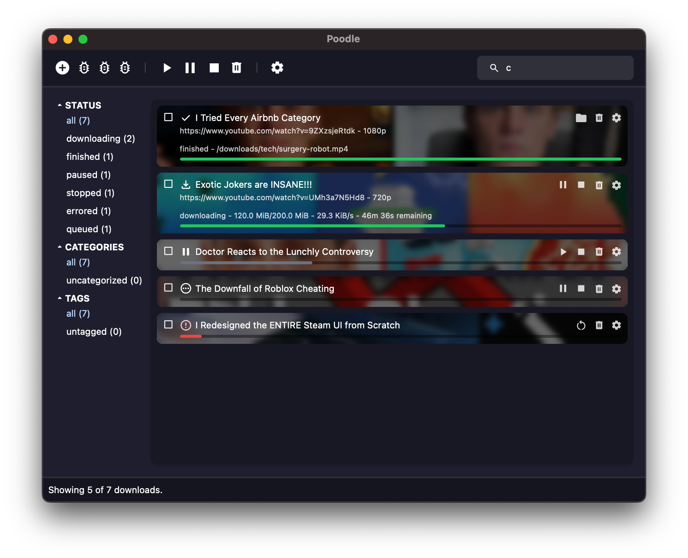

# Poodle

> [!CAUTION]
> **Current Status**: Pre-Alpha - Non-functional 
> 
> [See the Roadmap #1](https://github.com/rynmy/poodle/issues/1)

Poodle is a free and open-source frontend and manager for [yt-dlp](https://github.com/yt-dlp/yt-dlp), built on **Tauri** and **SvelteKit**. It lets you download and manage media from a variety of sources easily.

## Features

- **Download Videos & Audio**: Supports audio-only, video-only, or combined downloads.
- **Queue & Manage**: Organize your downloads, pause, resume, or stop them.
- **Customize Quality**: Set video and audio quality preferences.
- **Post-Processing**: Convert and compress downloads with FFmpeg.

## Join the Community
https://discord.gg/Hf43chcXQx

i should finish this readme
